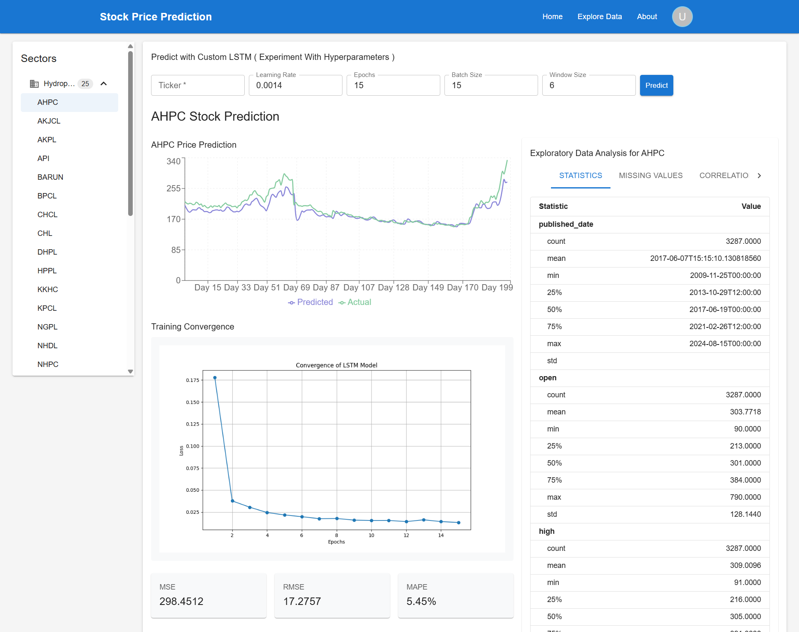

# 📊 StockSense – Stock Price Prediction App

**StockSense** is a stock price prediction web application that leverages a custom-built LSTM model implemented from scratch using `autograd`. It provides a clean, responsive UI for users to register, login, and get predictions for selected stocks based on historical data.

---

## 🚀 Tech Stack

### ⚙️ Backend
- **FastAPI** – Lightweight, high-performance Python web framework
- **Custom LSTM Model** – Built from scratch using `autograd`, `numpy`, and `matplotlib`
- **SQLite** – Lightweight database to store user data
- **Pandas & NumPy** – Data preprocessing and transformation

### 🌐 Frontend
- **React.js** – Component-based UI
- **Tailwind CSS** – Utility-first CSS framework
- **Material UI (MUI)** – Elegant UI components
- **Axios** – API communication

---

## ✨ Features

- 📈 Predict stock prices using LSTM
- 👤 User authentication (JWT-based login/signup)
- 🧠 EDA & preprocessing handled before prediction
- 💡 Handles sparse/incomplete stock data for multiple companies
- 📊 Convergence plot generation after training
- 🎨 Clean white and sky-blue themed UI

---

## 🧠 LSTM Model Highlights

This project includes a **fully custom LSTM implementation** with:
- Forward pass for single and batched sequences
- RMSProp-like optimization with gradient clipping
- Autograd-based backpropagation
- Convergence plot visualization
- Early stopping when gradient norms vanish

---

## 🧪 Running the Project

### 📦 Backend Setup

```bash
cd backend
python -m venv venv
source venv/bin/activate  # or venv\Scripts\activate on Windows
pip install -r requirements.txt
uvicorn main:app --reload

```
### 📦 Frontend Setup
```
cd frontend
npm install
npm start
```
📌 Limitations

1. Model performance is affected by limited data availability
2. No live stock integration (works on uploaded/available data only)
3. More feature engineering (technical indicators, etc.) can improve accuracy

🛠️ Future Improvements

1. Integrate live stock APIs (like Alpha Vantage or Yahoo Finance)
2. Add candlestick or OHLC charts using Chart.js or Recharts
3. Enhance authentication with refresh tokens and email verification
4. Deploy backend (e.g., on Render, Railway) and frontend (e.g., Vercel, Netlify)

## Screenshots

1. Login

[Login](Readme.md)

2. SectorWise Prediction


3. CompanyWise Prediction



4. CompanyWise EDA


5. User Profile


